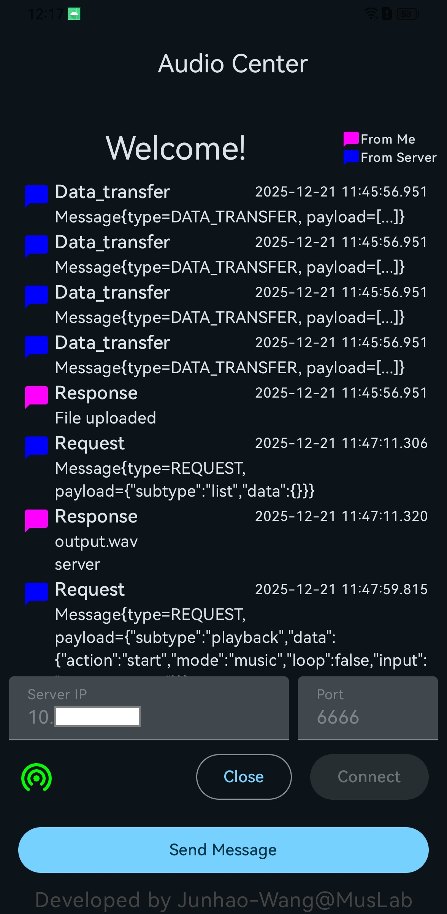

## SonicConductor (Client)

SonicConductor Client is the device-side component of an audio experiment orchestration platform built for researchers.
It connects smartphones/audio devices to a centralized control hub, enabling remote and coordinated recording/playback execution across multiple devices.

This design helps transform complex multi-device acoustic experiments from manual, interruption-prone operations into reproducible control flows — reducing operational overhead, minimizing human interference, and improving recording quality.
Hope this toolkit could be helpful for audio-related research/development ;)

The server side code could be found at [SonicConductor Hub](https://github.com/lannooo/AudioCenterServer)

## Requirements
- Android Studio
- Android device (API level 26+)
- Kotlin >= 1.5.1
- Gradle building tool (included in Android Studio maybe)

## Usage
1. Build and package the app with Android Studio
2. Install the apk on your mobile devices
3. Open the app and connect to the server with the server IP address and port number
4. Send a message to the server to register this device
5. The communication logs can be found in the log view

### UI

